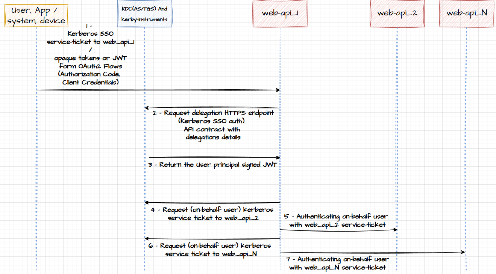

# kerby-instruments

**[Kerby](https://directory.apache.org/kerby/):**
- Java Lib with the implementation of the Kerberos protocol and a complete KDC(AS/TGS) server.
- Only Kerberos, not other protocol or service.
- KDC with: in-memory, Mavibot(MVCC BTree) or JSON backends to store data (principals and keys).
- Preauth mechanism using JWT or PKI mechanism to request TGT and Service-Tickets.

**[kerby-instruments](https://github.com/mesbrj/kerby-instruments):**
- Java spring boot REST API for Apache Kerby.
- Remote Kerberos administration, management, instrumentation, metrics and telemetry.
- user principals gnupg vault: user principals key-pairs (gnupg) - Encryption for user data (users are able to decide if the private key will be stored here or not).
- realm vault: kerby-instruments svc key pairs (gnupg) / keyPurposeClientAuth/Client Authentication (user principals) x.509 certs (and private keys) only for 
Kerberos and OAuth2 Flows usage / KDC cert and key.
- Realm constrained delegation based in users signed JWTs.
>**Self-signed private PKI embedded on Kerby-instruments:** 
- Needs supports to PKINIT EKUs keyPurposeKdc 1.3.6.1.5.2.3.5, keyPurposeClientAuth 1.3.6.1.5.2.3.4 and [some unusual fields for client certs and KDC cert](https://web.mit.edu/Kerberos/krb5-1.12/doc/admin/pkinit.html). Will be used to user authenticate with X.509 certificates (no need of keytabs or passwords inputs)
- Needs support to EKU Client Authentication 1.3.6.1.5.5.7.3.2. Clients will be able to create signed JTWs that can be validated in Ory Hydra
- PKI with OCSP and CRL support is pre-requirement
- Ory ecosystem needs to be configured to trust the self-signed PKI
- testing [XiPKI - eXtensible sImple Public Key Infrastructure](https://github.com/xipki/xipki) with [H2 database](https://www.h2database.com/html/main.html)
- OBS: JSON Web Signature (JWS) [RFC 7515](https://datatracker.ietf.org/doc/html/rfc7515). Attentions in ["x5u" (X.509 URL) Header Parameter](https://datatracker.ietf.org/doc/html/rfc7515#section-4.1.5) and ["x5c" (X.509 Certificate Chain) Header Parameter](https://datatracker.ietf.org/doc/html/rfc7515#section-4.1.6)

## Kerberos delegation

The RFC 4120: [The Kerberos Network Authentication Service (V5)](https://datatracker.ietf.org/doc/html/rfc4120), in the sections 2.5 to 2.8, defines the delegation aspects of kerberos: *When a backend service is doing authentication (in a second backend service) on behalf of the user connected in the frontend.*

The bellow Ticket tags can control the delegation on kerberos realm and are only interpreted by the ticket-granting-service and authentication-service (TGS and AS are part of KDC). 

- "**PROXIABLE**" and "**PROXY**" tags are used to control the requests of the service-tickets (only), from service principals on-behalf authenticated users principals. This tag can be defined by the user principal in the initial authentication (or any time when getting the TGT or service-tickets).
- "**FORWARDABLE**" flag control the requests of TGT (ticket-grant-tickets) from service principals on-behalf authenticated users principals. This tag can be defined by the user principal in the initial authentication (or any time when getting the TGT or service-tickets).
- "**OK-AS-DELEGATE**" tag is defined when a service principal is getting his TGT (from AS). Will help the realm policy delegation decisions.

Expected behavior using *FORWARDABLE* ticket tag:

*image source: https://learn.microsoft.com/en-us/openspecs/windows_protocols/ms-sfu/1fb9caca-449f-4183-8f7a-1a5fc7e7290a*

Microsoft extended the Kerberos delegation capabilities with a [Constrained Delegation Protocol](https://learn.microsoft.com/en-us/windows-server/security/kerberos/kerberos-constrained-delegation-overview) known as [Service for User (S4U)](https://learn.microsoft.com/en-us/openspecs/windows_protocols/ms-sfu/3bff5864-8135-400e-bdd9-33b552051d94)

The book-looker-realm will face the Kerberos delegation as follow:

- **Non-Java servers (service principals)**: Default Kerberos V5 behavior via delegation ticket tags. [Kerby KDC supports](https://github.com/apache/directory-kerby/blob/trunk/kerby-kerb/kerb-server/src/main/java/org/apache/kerby/kerberos/kerb/server/KdcConfigKey.java): PROXIABLE_ALLOWED and FORWARDABLE_ALLOWED. Unconstrained delegation (without OK-AS-DELEGATE flag) in a *"FORWARDABLE level"*.

- **Java servers (service principals)**: kerby-instruments *kerby realm alternative constrained delegation*, using user-principals signed JWTs.

## kerby realm alternative constrained delegation:

The kerby-instruments HTTPS (Kerberos authenticated) endpoints for delegation services, needs to be used for service principals (servers) needing to authenticate on-behalf of users.

The kerby-instruments will generate and validate the user-principal JWT via Client Credentials flow and will use a changed JWT with the correct claims. After all policy validations, the delegation can be processed (if the case) and the JWT will be sended as a cryptographic text material to the service principal. The service principal will use the KrbClient (Apache Kerby lib) and request (on-behalf a user via decrypted JWT) a service-ticket for the other service-principal.

Here we achieved a constrained delegation in a *"FORWARDABLE + OK-AS-DELEGATE level"* without using the kerberos protocol or data structures from Kerberos tickets.
The kerby-instruments (a KDC extension service) can act on-behalf of the user without user interaction and can apply policies on delegation requests, but in a *"FORWARDABLE + OK-AS-DELEGATE level"*. When the service principal get the user principal JWT, it can be used to request a TGT and service-tickets (for any another service-principal) on-behalf of the user.

## Custom instrumentation and telemetry

This project (GNU GPL3) includes the Apache Kerby (Apache License 2.0) Kerberos library and implementation (KDC and tools) and aims to provide one product with all the above features.

The remote (on the fly) administration (service administration not user/server principals or cert management) are achieved via HTTPS (authenticated Kerberos) administrative endpoints and all configuration aspects (including the PKI, DBs, logging, telemetry) are instrumented through these endpoints.

As a product, kerby-instruments aims to provide a comprehensive solution for Kerberos authentication and delegation, integrating seamlessly with customer existing infrastructure. The telemetry data needs to be easy to instrument, access and analyze, and the interoperability with existing systems and standards is a key.
HTTP SSE for telemetry stream, /metrics endpoint for Prometheus and API routes for generic HTTP client pulling. These three options are provided for flexibility and ease of integration.

The telemetry data needs to reflect the system's usage info beyond performance metrics. This includes user activity (how many authentications via cert, JWT, password), access patterns (delegations, cert issuance), and etc...

## Positive points about Kerberos

- **Service Session key** - Each client/server connection has its own session key, providing per-connection security (each Kerberos client connected to a MariaDB has its own session key, for example).
- **Mutual Authentication** - Both client and server verify each other's identity.
- **KDC Centralization** - In a Kerberos service/protocol/realm, only KDC servers have TCP/UDP listening ports (for Kerberos). When the client from a file-server or DB "kerberized" has aquired a service-ticket from a KDC using his valid TGT (to access the file-server or DB), the service-ticket is used in the authentication process\step from a given service\protocol (file-share or DB connection, for example).
- **Cross-Platform Support** - Widely supported across various operating systems and applications.
- **Strong Security** - Encrypted tickets and time-limited credentials.
- **Single Sign-On** - Principals authenticate once and gain access to multiple services without re-entering credentials.
- **Delegation Support** - Kerberos allows use cases for delegation of credentials, enabling services to act (getting service-tickets) on behalf of users. Improving tracking and auditing of user actions.